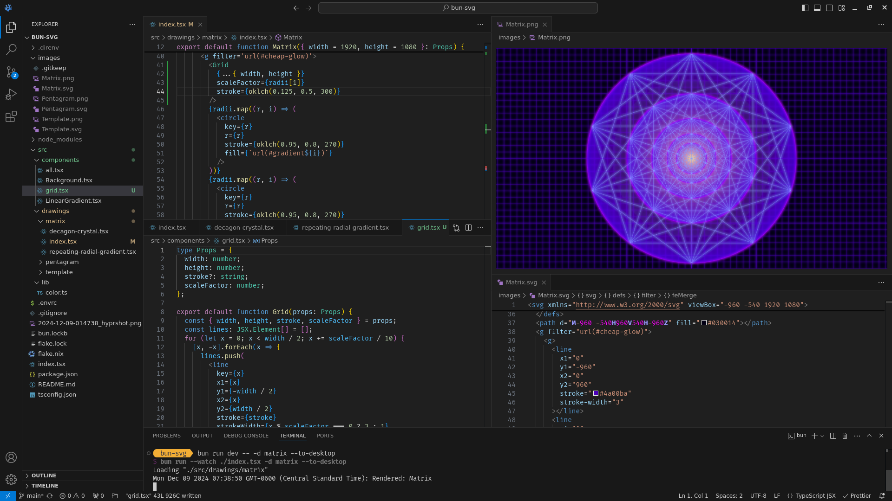

# bun-svg

Create SVG and PNG images using TypeScript and JSX.

I created this as a way to make desktop backgrounds, but I'll be extending it to create
images to concatenate into videos and plymouth boot screen animations.



## Requirements

Install Bun and ImageMagick.

- [Bun](https://bun.sh/) Javascript runtime and bundler.
- [ImageMagick](https://imagemagick.org/script/index.php) to convert SVG to PNG.
- [swww](https://github.com/LGFae/swww) to set desktop background (optional with `--to-desktop` flag)

If you're a [Nix or Nixos](https://nixos.org/) user, you can run `nix develop`
in the root directory, which will install Bun and ImageMagick into your shell
environment. If you have `direnv` configured, type `direnv allow` in the root
directory to autmatically initialize the shell environment upon entry.

```bash
bun install
```

To run, first copy the template component to whatever you want:

```bash
cp -r ./src/components/template ./src/components/whatever
```

```bash
bun run dev -- -d whatever
```

All flags:

```bash
--drawing     -d  drawing component to render
--output      -o  which display to put load the wallpaper to
--to-desktop      boolean whether to change the wallpaper
```

This will run the app and watch for changes. Images are written to `./images/$(componentName).{svg|png}`

This project was created using `bun init` in bun v1.1.34. [Bun](https://bun.sh) is a fast all-in-one JavaScript runtime.
